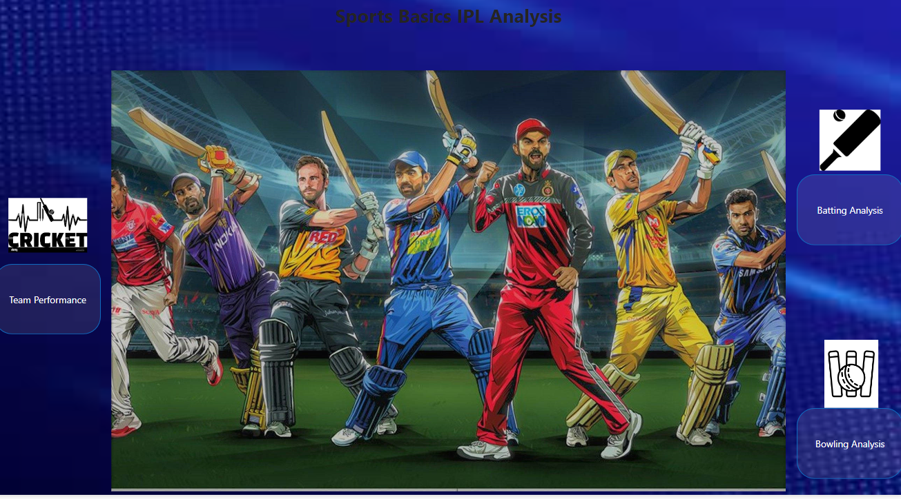

# IPL-Match-Analysis

## Project Overview
"Sports Basics" is a sports blog company that entered space recently. They wanted to get more traffic to their website by releasing a special edition magazine on IPL 2024. This magazine aims to provide interesting insights and facts for fans, analysts and teams based on the last 3 years' data.

## Match Related Terms
- Total Runs
- Total Innings Batted
- Total Innings Dismissed
- Batting Average
- Total balls Faced
- Strike Rate
- Batting Position
- Boundary %
- Avg. balls Faced
- Wickets
- balls Bowled
- Runs Conceded
- Bowling Economy
- Bowling Strike Rate
- Bowling Average
- Total Innings Bowled
- Dot Ball %

## Data Understanding
Understanding what data is available will be more helpful while doing analysis. before jumping on to the analysis get good understanding of what are data available.

Dimension table : It will have the static data like details of players

Fact table : It will have the data about the matches

dim_match_summary:
- team1: Name of the team batting first.
- team2: Name of the team batting second.
- winner: The team that won the match.
- margin: The margin by which the winning team won (runs or wickets).
- matchDate: The date on which the match was played, formatted as MMM DD, YYYY.
- match_id: Unique identifier for each match, prefixed with 'T'.
  
dim_players:
- name: The full name of the player.
- team: The IPL team the player is associated with.
- battingStyle: The batting style of the player (e.g., Right hand Bat, Left hand Bat).
- bowlingStyle: The bowling style of the player (e.g., Right arm Offbreak, Legbreak).
- playingRole: The primary role of the player in the team (e.g., Batter, Bowler, Allrounder).

fact_batting_summary:
- match_id: Links to the dim_match_summary for match details, prefixed with 'T'.
- match: Description of the match in "Team1 Vs Team2" format.
- teamInnings: The team that is batting in the specified innings.
- battingPos: The batting order position of the player.
- batsmanName: The name of the batsman.
- out/not_out: Indicates whether the batsman was out or not out.
- runs: The number of runs scored by the batsman.
- balls: The number of balls faced by the batsman.
- 4s: The number of boundaries (4 runs) hit by the batsman.
- 6s: The number of sixes hit by the batsman.
- SR (Strike Rate): The strike rate of the batsman during the innings.

fact_bowling_summary:
- match_id: Links to the dim_match_summary for match details, prefixed with 'T'.
- match: Description of the match in "Team1 Vs Team2" format.
- bowlingTeam: The team that is bowling in the specified innings.
- bowlerName: The name of the bowler.
- overs: The number of overs bowled by the player.
- maiden: The number of maiden overs bowled.
- runs: The number of runs conceded by the bowler.
- wickets: The number of wickets taken by the bowler.
- economy: The bowler's economy rate.
- 0s: The number of dot balls bowled.
- 4s: The number of boundaries conceded.
- 6s: The number of sixes conceded.
- wides: The number of wide balls bowled.
- noBalls: The number of no balls bowled.

  ## Data Model
- Data modeling plays a vital role and is considered as the basement of report. All the visuals will be build upon the data model.
- Poor data modeling affects the over all performance of the report.
- Following Good practices of data modeling is must. 
- In this project, we have followed Snowfall data modeling method.
     

  ## Home View
  - Team performance
  - Batting analysis
  - Bowling Analysis
    

 ## Team Performance
    - Best team analysis
    - Best batter
    - best bowler
  
      
 ##  Batting Analysis
 - Top 10 batsman
 - Total runs
 - Strike rate
  
## Bowling Analysis
- Top 10 bowler
- Total wickets
- Economy
  
     
  

